# Database Implementation
- Our database is implemented locally. We preprocessed the downloaded CSV files to eliminate noise by handling null entries, removing inconsistencies (such as job postings from companies not present in the company information CSV), and embedding text (such as replacing natural language segments with scalar values for more efficient computation). We also generate some sample users as well as their skills automatically. After preprocessing, we set up a local MySQL server to host the database. 
Here's the screenshot after connecting to our local database:
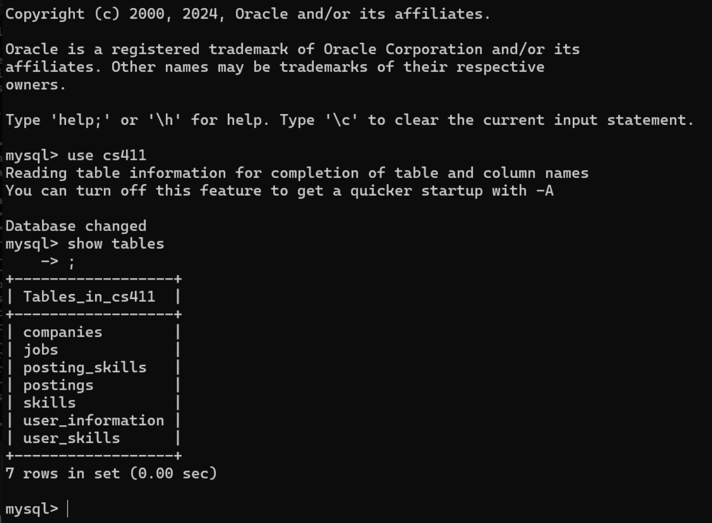

- We implemented [DDL commands](../backend/ddl.sql) for each of our tables.

- Insert data into tables: We have 3 tables of at least 1,000 rows: there are **24,473** rows in the **companies** table, **5,000** rows in the **jobs** table, and **48,48** rows in the **companies** table. All these tables contain existent (not auto-generated) data after preprocessing. Below is the screenshot as a proof:

# Advanced Queries
- Query 1: Our first query finds matching job postings for a user based on matching skills. Basically, with a certain `user_id`, it returns the `posting_id`, the `posting_title` and the `company_name` if the user meets all skill requirements for the job. You can access [Query 1](../backend/query1.sql) directly. Here's the screenshot of the top 15 rows:
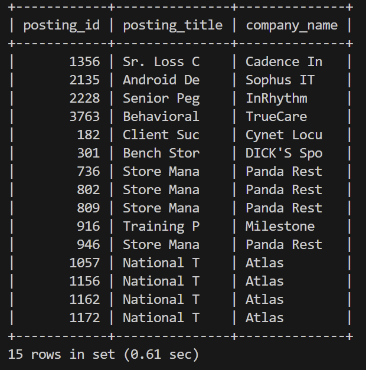

- Query 2: Our second query finds young users with in-demand skills but without niche skills. Specifically, we find `user_id` for users less than 25 years old, who not only have some skills required by 10% of all job postings, but also lack any skills required by less than 1% of all job postings. You can access [Query 2](../backend/query2.sql) directly. Here's the screenshot of the top 15 rows:

- Query 3: Our third query retrieves an ordered list of tuples of common skills and the number of occurrences of that skill in job postings, required for jobs offering the top 5% highest salaries. The list is ordered by the number of occurrences of the skill in all such high-paying job postings. You can access [Query 3](../backend/query3.sql) directly. Here's the screenshot of the top 15 rows:
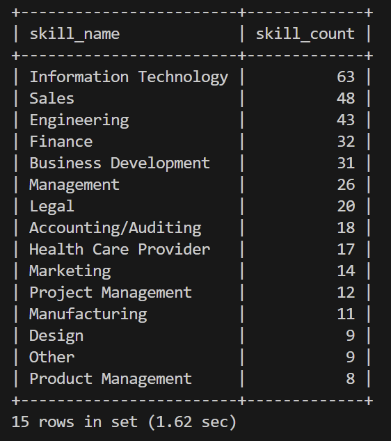

- Query 4: Our fourth query orders all postings based on similarity between needed skills and skills a user has. To determine the similarity between two sets of skills, we calculate the difference between the average of the embedded representation (scalars) of all skills in the set. You can access [Query 4](../backend/query4.sql) directly. Here's the screenshot of the top 15 rows:
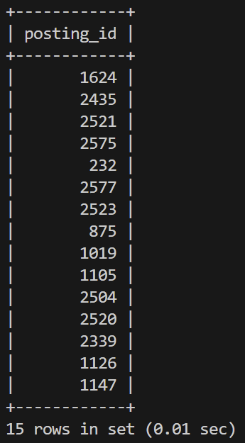

- Query 5: Our fifth query finds all companies with certain keywords in their description, as well as the count of skills needed that are similar to engineering. You can access [Query 5](../backend/query5.sql) directly. Here's the screenshot of the top 15 rows:
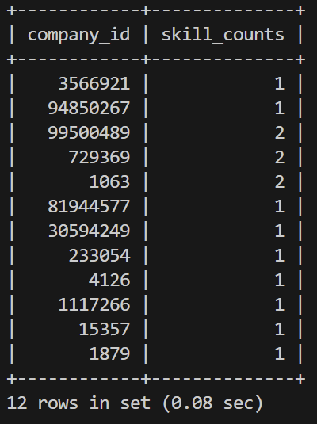

# Indexing
- Indexing on Query 1: We perform 3 different indexing designs excluding the default index: indexing on postings's `posting_title`, indexing on companies' `company_name`, and indexing on both of the above.
Here's the screenshot without indexing:
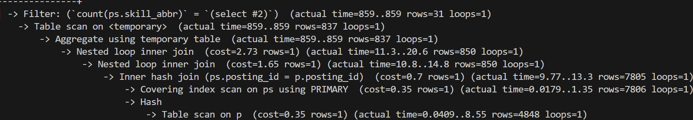

Here's the screenshot with indexing on `posting_title`:

Here's the screenshot with indexing on `company_name`:
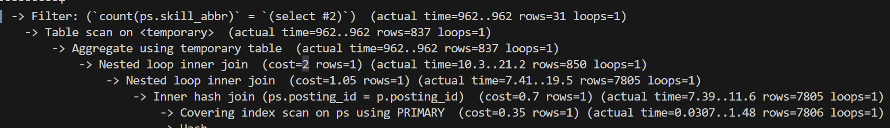

Here's the screenshot with indexing on both:
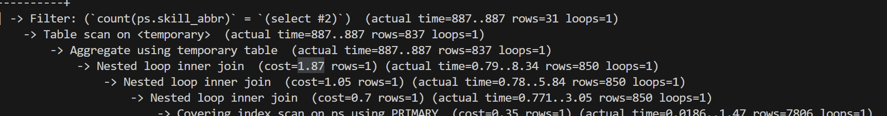

**Analysis**: Indexing on `posting_title` helps by allowing the database to quickly locate job postings based on their titles, reducing the search space and speeding up retrieval times. Indexing on `company_name` provides an even greater performance, probably because there are more companies, so searching for company without indexing is slower than searching for posting. When both indexes are applied, the database can efficiently combine the benefits of each, significantly minimizing the number of records scanned during the query execution.

- Indexing on Query 2: We perform 3 different indexing designs excluding the default index: indexing on user's `age`, indexing on skills' `skill_name`, and indexing on both of the above.
Here's the screenshot without indexing:
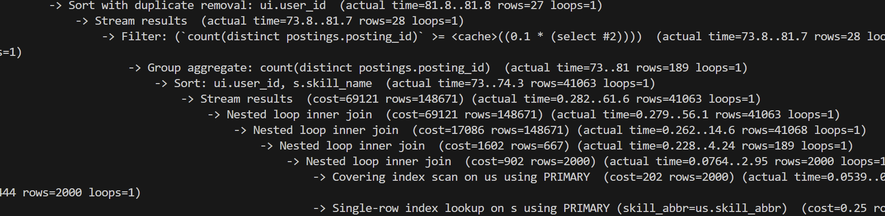

Here's the screenshot with indexing on `skill_name`:

Here's the screenshot with indexing on `age`:

Here's the screenshot with indexing on both:
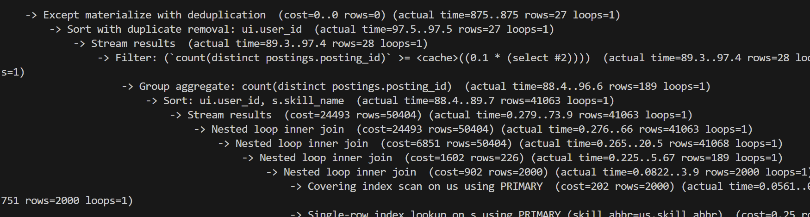

**Analysis**: Indexing on `age` helps in a similar way as the reason why the indexing on `posting_title` helps for Query 1. On create index on age, we have a search on age which can be improved a lot with a b-tree. Indexing on `skill_name` doesn't help probably due to its functional dependency with the `skill_abbr`, which is a primary key that can already be found efficiently. Then it's consistent that indexing on both has same result as indexing only `age`.

- Indexing on Query 5: We perform 3 different indexing designs excluding the default index: indexing on embedding, indexing on company descriptiobs, and indexing on both of the above.
We found that none of the index approaches yield a difference in performance as comparing to the default indexing. We got the following in all designs:
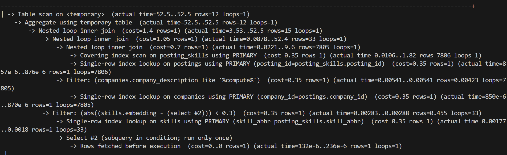

**Analysis**: The filters in this query rely on substring matching and distance calculations, which do not utilize indexing in most relational database systems. We guess that substring searches require full table scans since indexes are ineffective for partial matches or non-exact criteria. Similarly, distance calculations are computationally intensive and cannot be optimized through traditional indexing. 
