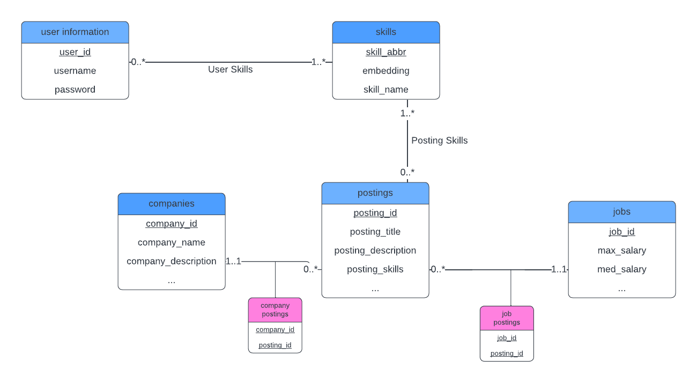

# Entities
- user_information - Each user needs to have a separate entity 
- skills - Skills will be shared across users and job postings, and it doesn’t make sense for skills to belong to either of the tables. 
- postings - postings are connected to both companies and jobs, and the many-to-many and many-to-one nature with companies and postings makes it not fit for an attribute
- companies - companies contain info that is independent from the job postings, and users might need to search for specific companies
- jobs - jobs table contains information that is independent from the postings. They might even have conflicting information that would not be suitable as a attribute 

# Relationship Cardinality & Assumptions
- user_information ↔ skills
    - Many to many
    - Requirement: we will require each user to choose at least one skill to start with, and can choose multiple if needed
    - There are hardly any skills that only one person has, so each skill will have multiple users
- skills ↔ postings
    - Many to many
    - Each posting will require one or more skills that are needed for the specific job
    - Assumption: likely each skill will be needed multiple times 
- postings ↔ companies
    - one to many
    - Each posting must be only posted by one company
    - A company can make several postings for different jobs
- postings ↔ jobs
    - many to one
    - Each job will have multiple postings, because one job can be posted multiple times to the same job board or different job boards
    - Assumption: Each job can be posted multiple times to the same or different job boards. This is necessary for scalability as we add more job postings from our original source (LinkedIn Job boards) or from other datasets (Glassdoor or Indeed APIs/datasets)

# Functional Dependencies/Normalization
Our database design was initially planned to be normalized to 3NF. Because our database already avoids many potential issues (duplication of data, data anomalies, referential integrity, etc.) through its simplistic design, we can simply look at the functional dependencies of each table. For scalability reasons and if we ever need to modify, we will maintain a 3NF schematic.

3NF:
- user_id -> username, password
- skill_abbr -> embedding, skill_name
- company_id -> company_name, company_description
- posting_id -> posting_title, posting_description, posting_skills
- job_id -> max_salary, min_salary

For each dependency, the left-hand-side already is a super key

# Relational Schema

user_information(user_id: INT [PK], username: VARCHAR(X), password: VARCHAR(X))

skills(skill_abbr: VARCHAR(X) [PK], embedding: VECTOR, skill_name: VARCHAR(X))

jobs(job_id: INT [PK], max_salary: DECIMAL, med_salary: DECIMAL)

companies(company_id: INT [PK], name: VARCHAR(X), description: VARCHAR(X))

postings(posting_id: INT [PK], title: VARCHAR(X), description: VARCHAR(X), company_id: INT [FK to companies.company_id], job_id: INT [FK to jobs.job_id])

skill_lists(user_id: INT [FK to user_information.user_id], skill_abbr: VARCHAR(X) [FK to skills.skill_abbr], [PK: user_id, skill_abbr])

posting_skills(skill_abbr: VARCHAR(X) [FK to skills.skill_abbr], posting_id: INT [FK to postings.posting_id], [PK: skill_abbr, posting_id])

# UML

