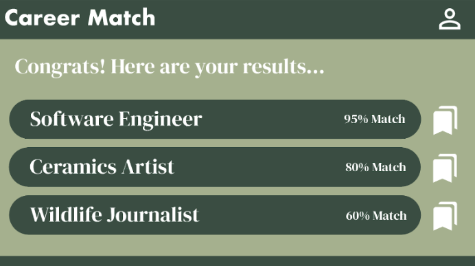
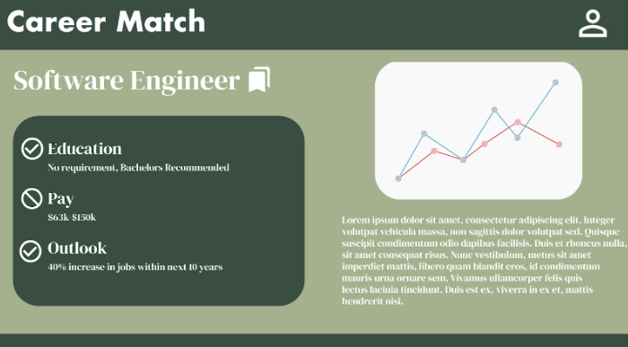
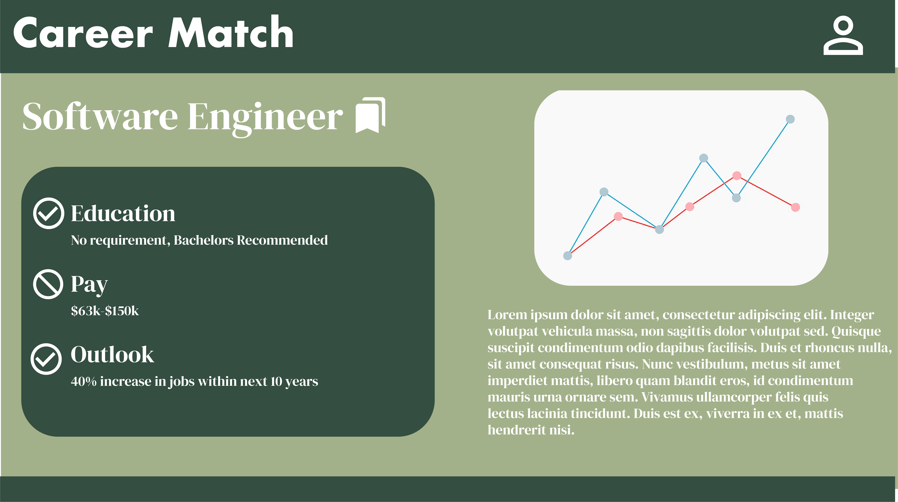

# Career Finder

## Members

Kelly Lin, Kaiyao Ke, Jarrett Cura, Victor Zhao

## Project Summary 

Career Finder is a web-based application designed to help users discover potential career paths based on their skills, interests, and personal values. By analyzing data on various job roles, required qualifications, and career trends, the system provides personalized career and job suggestions. Users can input their personal attributes, and the system will recommend career options using a database of professions from job postings that includes detailed information about required skills, job outlook, work environment, and average salaries. 

Using database manipulation techniques and machine learning involved analysis, Career Finder recommends careers and jobs that closely match the user’s profile, enabling them to make informed decisions about their future. This is done through matching a users skillset to commonly sought after skills in job postings associated with their preferred careers.

## Description

This application is designed to assist individuals who struggle to find a career path that aligns with their abilities and preferences. With so many career options available, it can be challenging for many to make decisions that best suit their skills and interests. We aim to address this issue by providing a platform where users can input their skills and interests to receive tailored career and job posting suggestions. 

The platform will make full use of relevant datasets and some NLP techniques to recommend relevant career options to users, and we hope this can alleviate some of the stress that comes with choosing a career or job. Additionally, the application helps individuals discover and explore career opportunities they may not have previously considered, opening doors to new possibilities for their professional future.

## Creative Component

The core problem to solve is to find the most suitable careers based on the user’s skills, interests, and values. Using the existing data on different careers(, more importantly, the skills, interests, values of the people with these careers), we can train a machine learning model that matches characteristics of skills or interests to each career, and visualize the potential career choices with their corresponding likelihood. 

With the existing forward matching model for careers, the users can also try out different potential skills or interests to see the resulting careers. An optimization algorithm can also be used to “reverse engineer” from a career choice, and find the skills that are needed for a specific career, or find the quickest fix in the skills or interests to achieve a certain probability for a given career. Users with clear goals can use this model to decide the skills they need to learn or reinforce in order to obtain a career. 

## Usefulness

This application is useful because it helps solve the issues of finding a career that benefits a particular person’s skillset, background, and beliefs. The target audience can be young adults planning their first job and hence career, people looking to change their current career, or people looking to reevaluate their current career choice. Several applications already look to solve this problem, including the Princeton Review Careers Quiz, the CareerFitter website and resources, and job posting websites like GlassDoor and Indeed which use one’s professional experience to recommend jobs.

Most career matching websites use a fixed set of questions and choices to identify the skill sets or personalities of the users. These can be time-consuming to complete to fill out, and questions related to perceptions or tendencies can sometimes be inconsistent based on the current internal state or external environment of the user. The user might also feel constrained by these items and miss out important information about some history or preferences. Recent developments in Natural Language Processing allow for more freeform inputs of skills a user has or prefers, and these can be analyzed to a similar degree of accuracy and detail compared with the fixed question items. Our website can leverage the NLP models, allowing the users to have more freedom when entering the information related to their skills, interests, and values than when they are using the existing career matching tools. 

Additionally, many job posting websites like Indeed and LinkedIn do not include information about career choices as a whole, which we plan to implement in each job posting through public career outlook data.

## Realness

The application will use real datasets such as the U.S. Bureau of Labor Statistics Occupational Outlook Handbook, which provides job categories, salary data, and employment projections (available in CSV format - https://www.bls.gov/cew/downloadable-data-files.htm). The annual dataset for 2023 has degree 42 and cardinality 3,618,279.  (note: is it too large?)  Columns 1-13 includes identification information, area titles, industry titles, and size titles, all represented in code format; columns 14-20 contain annual statistics like the average number of establishments, employment levels, total and taxable wages, and average pay; columns 21-28 provide location quotient data, comparing local statistics with national averages; and columns 29-42 include "over-the-year" changes, showing how key statistics such as employment levels and wages have changed from the previous year. (note: we might also need to preprocess some columns - for example, the “area code” is different for each county in the US… we might want to group by states) 

The application also uses the LinkedIn Job Posting dataset(https://www.kaggle.com/datasets/arshkon/linkedin-job-postings) in CSV format, providing additional information at company granularity. This dataset includes descriptions of jobs in natural language, which can help our machine learning algorithm to analyze user interests. The dataset has degree 31 and cardinality 124,000.

## Functionality

A user can create a profile by entering their skills, education, work experience, and other qualitative and quantitative metrics. By pressing a “Find Match” button, the user can search a database of job postings and search for ones tailored to their career choice. The user can then view detailed descriptions, average salaries, employment outlooks, and other useful information associated with the career on a new page. 

Additionally, the user can search for different careers or jobs manually, to decide for themselves if they are interested in certain careers using a basic search bar function in the header of the website. A user can click “bookmark” on a specific career page to add it to their profile to look at later. Within their profile, a user can update their personal information as well as delete bookmarks if wanted.

## UI Mockup

## Project Work Distribution 

As a group, we will all focus on similar areas of application development at the same time but split our team into different subgroups as necessary. This is so we can follow the stages of the CS 411 assignments, specifically the backend requirements so we can finish those as soon as possible. We also want to follow similar workflows throughout the project, so no one is constantly switching priorities (for example, someone setting up the database management system will be setting up security aspects, hence also doing authentication later on in the assignment).

- Backend Development:
    - Database Management - JC, KL
    - Data Preprocessing - KK, VZ
    - API development - KL, VZ

- ML/Creative Component:
    - ML Algorithm development - KL, KK
    - ML backend integration - JC, VZ

- Frontend Development
    - Frontend development - JC, KL
    - Data visualization - KK, VZ

- Logistical/Maintenence
    - Authentication - JC, KK
    - Deployment - KL, VZ
    - Testing - JC, KK, VZ, KL
